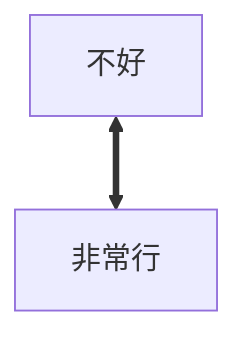
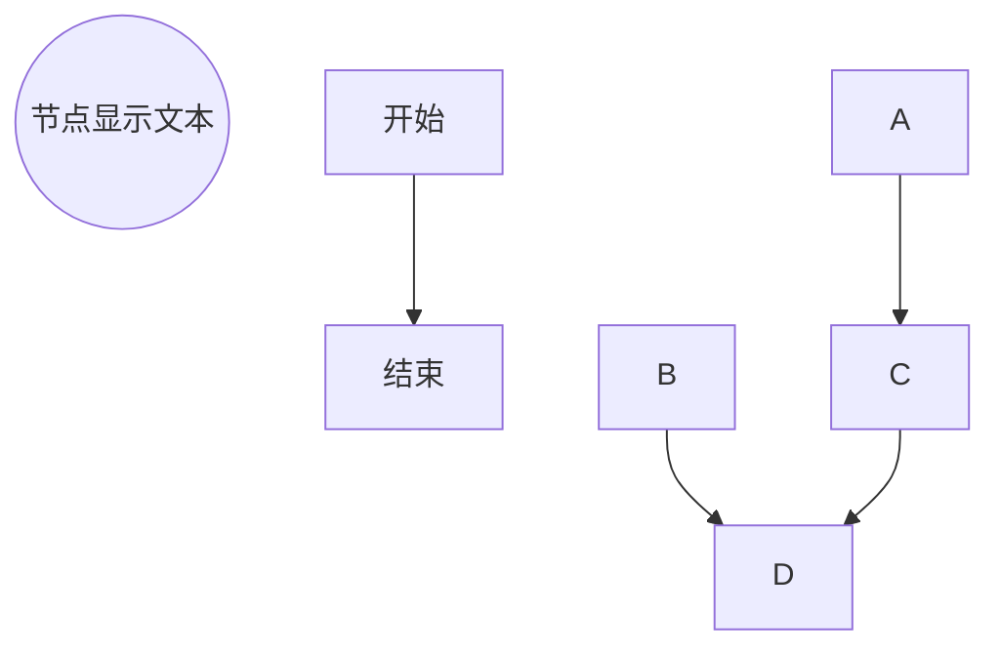
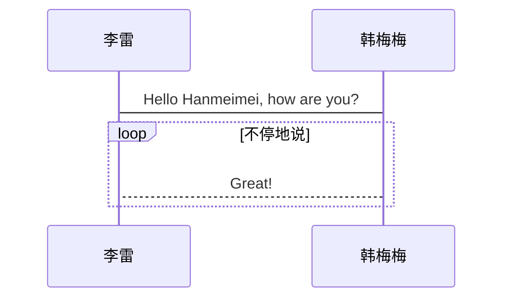

# Markdown 必须会使用的文本编辑语法

## 代码块

### 首行缩进4格
    sudo -i
### 四个反引号"`" 后面可以跟代码类型
````Json
{
  "sudo":'-i'
}
````
___
## 超链接
### 基本样式
- [北京]()
- [上海](link)
### 全局样式
- [北京][beijing] 是一个好地方,全局定义一个链接。 

[beijing]: http://www.tiantanpark.com


- [全局链接][]可以是中文，那么两个中括号内的内容一样可以省略一个

[全局链接]: link 

### 注意
1. 使用全局声明时，超链接的 ID 是不区分大小写的；
2. 使用全局声明时，超链接的 ID 可以包含空格、使用纯数字。
3. 链接超过2次使用，可以使用全局声明。
4. 链接全局声明一般放在文章末尾。

___
## 段落
对正文的处理
### 正文
没有任何标记的会被认为是正文
### 不分段换行
换行是初学者很容易遇到的问题。不同于分段换行，不分段换行不是用 `<p>` 标签描述段落，而是用 `<br>` 标签折断文字。如果要让文字另起一行而不分段，需在行尾增加两个  
这个换行前面加了两个空格然后enter 换行。
### 缩进
Markdown 最初为英文文章设计，而英文文章中最常见的段落排版便是 “齐头式”，也就是说每一行文字都顶头书写，各个段落之间用空行分隔。Markdown 原生语法并不支持缩进，避免因为不同段落的个性化影响整篇文章的样式一致性。
如果我们依然需要在 Markdown 文件中实现首行缩进样式，可通过以下几种方式：

- 转义字符/全角空格/全局修改p 样式

### 空白行
Markdown 原生语法不支持空行。

空行一般出现在段落之间，用于区分大段文字组织关系。段落间距的调整要通过修改文章的整体样式实现。如果我们需要在文档中插入空白行，可通过以下方式：

- 在 Markdown 中，即使插入多个换行符，渲染时也会被合并成单一空行


- 方法一 使用 html `<br>`  标签实现  
<br/>
空行插入(注意行尾有两个空格)

- 方法二 使用 '全角空格' 实现  
　  
空行插入(注意行尾有两个空格)
- 方法三 使用转义字符 `\`   
\
加上enter实现空行插入(注意行尾有两个空格)

- 总结来说就是 `先两个空格换行`，然后在插入 `br` `全角空格` `转义符`  达到插入一个空白行 `转义字符方法最好用`

___
## 分割线
我们可以通过输入三个或更多的「减号 -」、「星号 *」、「下划线 -」的方式创建一条相当于 HTML 语法中 `<hr/>` 一样的分隔线 

---
***
___

### 注意
1. 分割线使用的关键字 `*、-、_，`都包含多种语义，当我们希望增加分割线的时候，请注意确保该字符连续出现，并且保证至少三个，同时，该行前后不允许有别的内容；

2. 使用减号` -，`用于分隔线的时候需要注意，因为减号还有`二级标题`的作用，即在一行文字的下面插入三个减号时，该文字变成二级标题，所以使用减号需要确保前面有一空行

`会变成二级标题`
---

3. 建议在文章中都是用下划线 _，作为换行的输入，这样避免语义错误，同时与 Word 的方式更加接近。

___
## 中划线语法
~~这是一条删除线~~

当删除线内部紧跟 "空格" 时，删除线效果会失效。

~~有效的删除线~~

~~失效的删除线 ~~
___
### 使用 `style` 的标签的修改文字前景色/背景色
<font style="color: red">红色</font>

<font style="color: green;background:blue">绿色</font>

<font style="color: blue">蓝色</font>

<font style="color: rgb(200,100,100)">使用 rgb 颜色值</font>

<font style="color: #FF00BB">使用十六进制颜色值</font>

___
## 行内代码  
<br>

### 一些常见的表情符号

开心：`(⊙ᗜ⊙)` `（‐＾▽＾‐）` ` ٩(๑òωó๑)۶` `ヾ（≧?≦）〃` `o(>ω<)o` `(￣▽￣)ノ`

伤心：`(；´д｀)ゞ` `(；д；)` `(；へ：)` `(╥╯╰╥)` `╮(╯﹏╰）╭` `╭(╯╰)╮` `(╯︵╰)`

惊讶：`ɖී؀ීϸ` ` (」゜ロ゜)」` `` (´⊙ω⊙`)！``  ` щ(゜ロ゜щ)`  ` ༼∩•́ω•̀∩༽` `໒( ◑ w ◑ )७` `ԅ༼ . º ʖ̯ º . ༽ง` `(⊹◕ʖ̯◕)、`

___
## 图片
在 Markdown 文件中，使用 `")` 的形式定义图片


<style>
  img {
    width:120px;
    height:120px;
    border-radius: 50% !important;
    border: 3px solid #eee;
  }
</style>


##  画图










